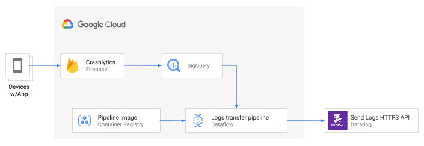
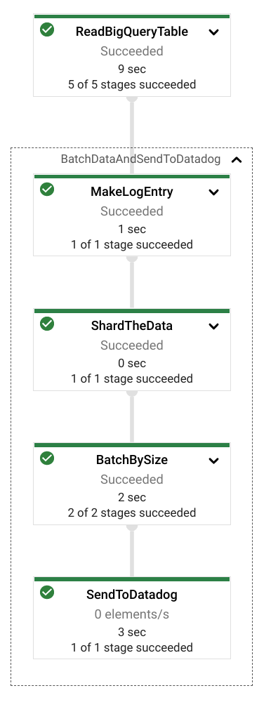
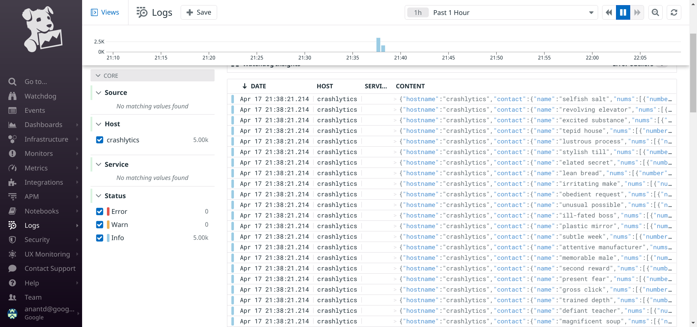

# Export Firebase Crashlytics BigQuery logs to Datadog using Dataflow

This document discusses how to export [Firebase Crashlytics](https://firebase.google.com/docs/crashlytics) logs from BigQuery tables to [Datadog](https://www.datadoghq.com/).

Firebase Crashlytics is a lightweight, realtime crash reporter that helps you track, prioritize, and fix stability issues that erode your app quality.
Crashlytics saves you troubleshooting time by intelligently grouping crashes and highlighting the circumstances that lead up to them.

Firebase Crashlytics provides [BigQuery exports](https://firebase.google.com/docs/crashlytics/bigquery-export) 
to enable further analysis in BigQuery, that allows combining your [Cloud logging exports](https://cloud.google.com/logging/docs/export/bigquery) 
or your own first-party data. You can then [use Data Studio dashboard](https://firebase.googleblog.com/2018/11/using-google-data-studio-with-crashlytics.html) to visualize this data.

Datadog is a log monitoring platform and Google Cloud partner that provides application and 
infrastructure monitoring service, it has native [integration with Google Cloud](https://console.cloud.google.com/marketplace/details/datadog-saas/datadog). 

This document is intended for a technical audience whose responsibilities include logs management or data analytics. 
This document assumes that you're familiar with [Dataflow](https://cloud.google.com/dataflow), have some familiarity with Bash scripts and basic knowledge of Google Cloud.

## Architecture

 
 The batch Dataflow pipeline process the Crashlytics logs in BigQuery as follows:
 1.  Read the BigQuery table (or partition) 
 2.  Transform the BigQuery TableRow into a JSON string, and incorporate into Datadog log entry format. 
 3.  The pipeline uses two optimizations 
     *  Batch log messages into 5Mb (or 1000 entries) batches to reduce the number of API calls
     *  GZip the request to reduce network bandwidth  

## Objectives

*   Create a service account with limited access.
*   Create a Dataflow Flex template pipeline to send Crashlytics logs to [Datadog](https://www.datadoghq.com/) using [Send Log API](https://docs.datadoghq.com/api/latest/logs/#send-logs)
*   Verify Crashlytics imported all Crashlytics logs.

## Costs

This tutorial uses billable components of Google Cloud, including the following:

*   [Dataflow](https://cloud.google.com/dataflow)
*   [Cloud Storage](https://cloud.google.com/storage)
*   [Network Egress](https://cloud.google.com/vpc/network-pricing#internet_egress)

Use the [pricing calculator](https://cloud.google.com/products/calculator) to generate a cost estimate based on your projected usage.

## Before you begin

For this tutorial, you need a Google Cloud [project](https://cloud.google.com/resource-manager/docs/cloud-platform-resource-hierarchy#projects). To make
cleanup easiest at the end of the tutorial, we recommend that you create a new project for this tutorial.

1.  [Create a Google Cloud project](https://console.cloud.google.com/projectselector2/home/dashboard).
1.  Make sure that [billing is enabled](https://support.google.com/cloud/answer/6293499#enable-billing) for your Google
    Cloud project.
1.  [Open Cloud Shell](https://console.cloud.google.com/?cloudshell=true).

    At the bottom of the Cloud Console, a [Cloud Shell](https://cloud.google.com/shell/docs/features) session opens and
    displays a command-line prompt. Cloud Shell is a shell environment with the Cloud SDK already installed, including
    the [gcloud](https://cloud.google.com/sdk/gcloud/) command-line tool, and with values already set for your current
    project. It can take a few seconds for the session to initialize.

1.  Enable APIs for Cloud DLP, Cloud KMS, Compute Engine, Cloud Storage, Dataflow, and BigQuery services:

        gcloud services enable \
        compute.googleapis.com \
        storage.googleapis.com \
        dataflow.googleapis.com \
        bigquery.googleapis.com \
        cloudbuild.googleapis.com
        
    Using browser [Enable APIs](https://console.cloud.google.com/flows/enableapi?apiid=compute.googleapis.com,storage.googleapis.com,dataflow.googleapis.com,bigquery.googleapis.com,cloudbuild.googleapis.com&redirect=https://console.cloud.google.com)

## Setting up your environment

1.  In Cloud Shell, clone the source repository and go to the directory for this tutorial:

        git clone https://github.com/GoogleCloudPlatform/crashlytics-logs-to-datadog.git
        cd crashlytics-logs-to-datadog/

1.  Use a text editor to modify the `set_environment.sh` file to set the required environment variables:

        # The Google Cloud project to use for this tutorial
        export PROJECT_ID="<your-project-id>"
        
        # The Compute Engine region to use for running Dataflow jobs
        export REGION_ID="<compute-engine-region>"
        
        # define the GCS bucket to use for Dataflow templates and temporary location.
        export GCS_BUCKET="<name-of-the-bucket>"
        
        # Name of the service account to use (not the email address)
        export PIPELINE_SERVICE_ACCOUNT_NAME="<service-account-name-for-runner>"
        
        # The API Key created in Datadog for making API calls
        # https://app.datadoghq.com/account/settings#api
        export DATADOG_API_KEY="<your-datadog-api-key>"

1.  Run the script to set the environment variables:

        source set_environment.sh

## Creating resources

The tutorial uses following resources:

 * A service account to run Dataflow pipelines, enabling fine-grained access control
 * A Cloud Storage bucket for temporary data storage and test data

### Create service accounts

We recommend that you run pipelines with fine-grained access control to improve access partitioning,
by provisioning the least permissions required for each service-account.
If your project doesn't have a user-created service account, create one using following instructions.

1.  Create a service account to use as the user-managed controller service account for Dataflow:

        gcloud iam service-accounts create  "${PIPELINE_SERVICE_ACCOUNT_NAME}" \
        --project="${PROJECT_ID}" \
        --description="Service Account for Datadog export pipelines." \
        --display-name="Datadog logs exporter"

1.  Create a custom role with required permissions for accessing Cloud DLP, Dataflow, and Cloud KMS:

        export DATADOG_SENDER_ROLE_NAME="datadog_sender"

        gcloud iam roles create "${DATADOG_SENDER_ROLE_NAME}" \
        --project="${PROJECT_ID}" \
        --file=datadog_sender_permissions.yaml

1.  Apply the custom role to the service account:

        gcloud projects add-iam-policy-binding "${PROJECT_ID}" \
        --member="serviceAccount:${PIPELINE_SERVICE_ACCOUNT_EMAIL}" \
        --role="projects/${PROJECT_ID}/roles/${DATADOG_SENDER_ROLE_NAME}"

1.  Assign the `dataflow.worker` role to allow a Dataflow worker to run with the service-account credentials:

        gcloud projects add-iam-policy-binding "${PROJECT_ID}" \
        --member="serviceAccount:${PIPELINE_SERVICE_ACCOUNT_EMAIL}" \
        --role="roles/dataflow.worker"
        
### Create the Cloud Storage bucket

Create a Cloud Storage bucket for storing test data and Dataflow staging location:

    gsutil mb -p "${PROJECT_ID}" -l "${REGION_ID}" "gs://${GCS_BUCKET}"

## Build and launch Dataflow pipeline

Test and compile the pipeline code.

    ./gradlew clean build shadowJar

The pipeline supports following options:

| parameter | Default value | description |
| --- | --- | --- |
| `sourceBigQueryTableId` | - |  A Fully qualified BigQuery TableId in <b>\<projectId\>:\<datasetId\>.\<tableId\>\[:$\<parition_date\>\]</b> |
| `bigQuerySqlQuery` | - | The BigQuery SQL query results to send to Datadog. |
| `shardCount` | **10** | The number of parallel processes to send to Datadog. Using a higher number can result in overloading the Datadog API.|
| `preserveNulls` | `false` | Allow null values from BigQuery source to be serialized.
| `datadogApiKey` | - | Provide the API key from [Datadog console](https://app.datadoghq.com/account/settings#api) |
| `datadogEndpoint` | **https://http-intake.logs.datadoghq.com/v1/input** | Refer Datadog [logging endpoints](https://docs.datadoghq.com/logs/log_collection/?tab=host#logging-endpoints)|
| `datadogSource` | **crashlytics-bigquery** | Refer to the Datadog [log entry structure](https://docs.datadoghq.com/api/latest/logs/#send-logs)   you can customize these parameters to suit your needs |
| `datadogTags` | **user:crashlytics-pipeline** | Refer to the Datadog [log entry structure](https://docs.datadoghq.com/api/latest/logs/#send-logs)   you can customize these parameters to suit your needs |
| `datadogLogHostname` | **crashlytics** | Refer to the Datadog [log entry structure](https://docs.datadoghq.com/api/latest/logs/#send-logs)   you can customize these parameters to suit your needs |

Use only one of `sourceBigQueryTableId` or `bigQuerySqlQuery`.

Define the Crashlytics exported BigQuery table name

    export CRASHLYTICS_BIGQUERY_TABLE="<projectId>:<datasetId>.<tableId>"

> **Note:** Make sure the serviceAccount has access to this BigQuery table.

You can directly launch the pipeline from the shell using following command:

    bq_2_datadog_pipeline \
    --project="${PROJECT_ID}" \
    --region="${REGION_ID}" \
    --runner="DataflowRunner" \
    --serviceAccount="${PIPELINE_SERVICE_ACCOUNT_EMAIL}" \
    --gcpTempLocation="gs://${GCS_BUCKET}/temp" \
    --stagingLocation="gs://${GCS_BUCKET}/staging" \
    --tempLocation="gs://${GCS_BUCKET}/bqtemp" \
    --datadogApiKey="${DATADOG_API_KEY}" \
    --sourceBigQueryTableId="${CRASHLYTICS_BIGQUERY_TABLE}"
    
You can monitor the Dataflow job on Cloud Console. The pipeline DAG looks as follows:

### Create Dataflow flex template

[Dataflow templates](https://cloud.google.com/dataflow/docs/concepts/dataflow-templates) allow you to use the Google Cloud Console, the gcloud command-line tool, or REST API calls to set up your pipelines on Google Cloud and run them. Classic templates are staged as execution graphs on Cloud Storage while Flex Templates bundle the pipeline as a container image in your project’s Container Registry. This allows you to decouple building and running pipelines, as well as integrate with orchestration systems for daily execution. You can learn more about [differences between classis and flex templates](https://cloud.google.com/dataflow/docs/concepts/dataflow-templates#comparing-templated-jobs).

To build a flex template, define the location to store template spec file containing all the necessary information to run the job:

    export TEMPLATE_PATH="gs://${GCS_BUCKET}/dataflow/templates/bigquery-to-datadog.json"
    export TEMPLATE_IMAGE="us.gcr.io/${PROJECT_ID}/dataflow/bigquery-to-datadog:latest"

Build Dataflow Flex template

    gcloud dataflow flex-template build "${TEMPLATE_PATH}" \
    --image-gcr-path="${TEMPLATE_IMAGE}" \
    --sdk-language="JAVA" \
    --flex-template-base-image=JAVA11 \
    --metadata-file="bigquery-to-datadog-pipeline-metadata.json" \
    --service-account-email="${PIPELINE_SERVICE_ACCOUNT_EMAIL}" \
    --jar="build/libs/crashlytics-logs-to-datadog-all.jar" \
    --env="FLEX_TEMPLATE_JAVA_MAIN_CLASS=\"com.google.cloud.solutions.bqtodatadog.BigQueryToDatadogPipeline\""    
    
### Launch pipeline using flex-template

Launch the pipeline using the flex template created in the previous step.

    gcloud dataflow flex-template run "bigquery-to-datadog-`date +%Y%m%d-%H%M%S`" \
    --region "${REGION_ID}" \
    --template-file-gcs-location "${TEMPLATE_PATH}" \
    --service-account-email "${PIPELINE_SERVICE_ACCOUNT_EMAIL}" \
    --parameters sourceBigQueryTableId="${CRASHLYTICS_BIGQUERY_TABLE}" \
    --parameters datadogApiKey="${DATADOG_API_KEY}"
    
### Verify logs in Datadog console

Visit Datadog [logs viewer](https://app.datadoghq.com/logs?query=status%3Ainfo+host%3Acrashlytics) to verify the logs are available in Datadog.

## Cleaning up

To avoid incurring charges to your Google Cloud account for the resources used in this tutorial, you can delete the project.

Deleting a project has the following consequences:

- If you used an existing project, you'll also delete any other work that you've done in the project.
- You can't reuse the project ID of a deleted project. If you created a custom project ID that you plan to use in the
  future, delete the resources inside the project instead. This ensures that URLs that use the project ID, such as
  an `appspot.com` URL, remain available.

To delete a project, do the following:

1.  In the Cloud Console, go to the [Projects page](https://console.cloud.google.com/iam-admin/projects).
1.  In the project list, select the project you want to delete and click **Delete**.
1.  In the dialog, type the project ID, and then click **Shut down** to delete the project.

## What's next

- Learn more about [Firebase Crashlytics](https://firebase.google.com/docs/crashlytics)
- Learn how can [Cloud Logging](https://cloud.google.com/logging) and [Cloud Monitoring](https://cloud.google.com/monitoring) help solve your needs.
- Learn more about [AI on Google Cloud](https://cloud.google.com/solutions/ai/).
- Learn more about [Cloud developer tools](https://cloud.google.com/products/tools).
- Learn more about deploying [Datadog on Google Cloud](https://console.cloud.google.com/marketplace/details/datadog-saas/datadog?)
- Try out other Google Cloud features for yourself. Have a look at our [tutorials](https://cloud.google.com/docs/tutorials).
